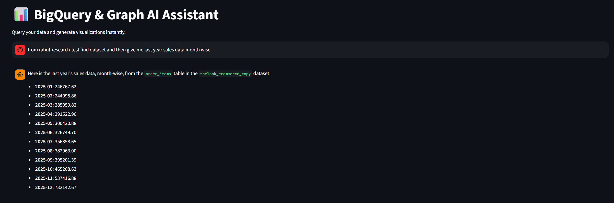
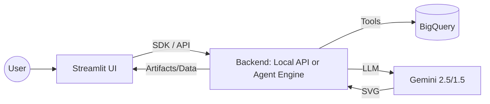

# 📊 BigQuery & Graph AI Assistant

A powerful, AI-driven assistant that allows users to query Google BigQuery data using natural language and generate professional SVG visualizations instantly.

## 📸 Screenshots


*The premium Streamlit interface with dark mode and smooth animations.*


*Mathematically precise SVG visualizations generated by the GraphAgent.*

## 🏗️ Architecture

The project follows a modern, decoupled architecture with two deployment options:

1.  **Streamlit UI**: A premium frontend that manages user sessions and communicates with the backend.
2.  **Backend Options**:
    *   **ADK API Server**: A local server that hosts the agents and manages artifacts.
    *   **Vertex AI Agent Engine**: A fully managed service on GCP for hosting and scaling ADK agents.
3.  **Gemini 2.5 Flash / Pro**: The underlying LLM that powers both data analysis and SVG generation.



## ✨ Features

### BigQuery Integration

The application leverages the **BigQuery Toolset** from ADK, providing comprehensive data access and analysis capabilities:

-   **🗂️ Dataset Discovery**: List and explore all datasets in your GCP project with `list_dataset_ids` and `get_dataset_info`.
-   **📊 Table Exploration**: Browse tables within datasets using `list_table_ids` and inspect detailed metadata with `get_table_info`.
-   **🔍 SQL Execution**: Run custom SQL queries directly against BigQuery with `execute_sql`.
-   **📈 AI-Powered Forecasting**: Generate time series forecasts using BigQuery's `AI.FORECAST` function via the `forecast` tool.
-   **💬 Natural Language Insights**: Ask questions about your data in plain English using `ask_data_insights`.

### Visualization & UI

-   **🎨 SVG Generation**: The GraphAgent creates mathematically precise, professional SVG visualizations.
-   **🛡️ Robust Rendering**: Permissive rendering logic that recursively searches for image data in complex agent responses, ensuring graphs are always visible.
-   **💎 Premium Design**: A custom-styled Streamlit interface featuring dark mode, glassmorphism effects, and smooth animations.
-   **🔄 Artifact System**: Visualizations are managed as artifacts, allowing for easy retrieval and display.

## 📁 Project Structure

-   `data_agent_viz/`: Contains the AI agent definitions, custom tools, and instructions.
-   `ui/`: The Streamlit application files.
    -   `app_local.py`: Connects to a local ADK API server.
    -   `app_agentEngine.py`: Connects directly to a deployed Vertex AI Agent Engine.
-   `requirements.txt`: Project dependencies.

## 🚀 Getting Started

### 1. Prerequisites
-   Python 3.10+
-   Google Cloud Project with BigQuery enabled.
-   Service Account JSON key with BigQuery Data Viewer permissions.

### 2. Installation
```bash
pip install -r requirements.txt
```

### 3. Configuration
Create a `.env` file in the root directory:

```env
# For Local API
API_URL=http://127.0.0.1:8000

# For Vertex AI Agent Engine
PROJECT_ID=your-project-id
LOCATION=us-central1
```

**BigQuery Setup:**
1.  Place your BigQuery service account JSON key in the `data_agent_viz/` folder.
2.  Follow the instructions in `data_agent_viz/tools.py` to set the project ID and credential path.

### 4. Running the Project

**Option A: Local Development**
1. Start the API Server: `adk api_server --reload --reload_agents`
2. Start the Local UI: `streamlit run ui/app_local.py`

**Option B: Production (Agent Engine)**
1. Ensure your agent is deployed to Vertex AI.
2. Update the `RESOURCE_NAME` in `ui/app_agentEngine.py`.
3. Start the Engine UI: `streamlit run ui/app_agentEngine.py`

## 🔐 Session Management

Sessions are managed to ensure a seamless chat experience:
-   **Local**: UI generates `user_id` and `session_id`, which are used by the ADK API for persistence.
-   **Agent Engine**: The Vertex AI SDK handles session context via the `session_id` parameter in the `query` method.
-   **Persistence**: Both methods ensure that agents maintain context and can reference previous conversation parts.
