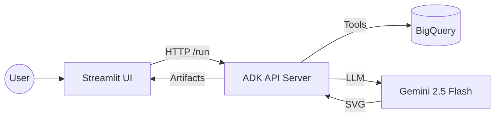

# 📊 BigQuery & Graph AI Assistant

A powerful, AI-driven assistant that allows users to query Google BigQuery data using natural language and generate professional SVG visualizations instantly.

## 🏗️ Architecture

The project follows a modern, decoupled architecture:

1.  **Streamlit UI**: A premium frontend that manages user sessions and communicates with the backend via HTTP.
2.  **ADK API Server**: The core engine that hosts the AI agents, manages artifacts (like graphs), and handles session persistence.
3.  **Gemini 2.5 Flash**: The underlying LLM that powers both the data analysis and the SVG generation.



## 📁 Project Structure

-   `data_agent_viz/`: Contains the AI agent definitions and custom tools.
-   `ui/`: The Streamlit application code.
-   `requirements.txt`: Project dependencies.

## 🚀 Getting Started

### 1. Prerequisites
-   Python 3.10+
-   Google Cloud Project with BigQuery enabled.
-   Service Account JSON key with BigQuery Data Viewer permissions.

### 2. Installation
```bash
pip install -r requirements.txt
```

### 3. Configuration
Create a `.env` file in the root directory with your API credentials. 

**If using Google AI (Gemini API):**
```env
GOOGLE_API_KEY=your_gemini_api_key
```

**If using Vertex AI:**
```env
GOOGLE_GENAI_USE_VERTEXAI=1
GOOGLE_CLOUD_PROJECT=your-project-id
GOOGLE_CLOUD_LOCATION=us-central1
```

**BigQuery Setup:**
1.  Place your BigQuery service account JSON key in the `data_agent_viz/` folder.
2.  Open `data_agent_viz/tools.py` and ensure the `json_path` and `GOOGLE_CLOUD_PROJECT` match your local file name and project ID:
    ```python
    os.environ["GOOGLE_CLOUD_PROJECT"] = "your-project-id"
    json_path = os.path.join(base_dir, "your-service-account-file.json")
    ```

### 4. Running the Project
**Start the API Server:**
```bash
adk api_server --reload --reload_agents
```

**Start the UI:**
```bash
streamlit run ui/app.py
```

## 🔐 Session Management

Sessions are managed end-to-end to ensure a seamless chat experience:
-   **UI Layer**: Automatically generates a unique `user_id` and `session_id` using `st.session_state`.
-   **API Layer**: Uses these IDs to maintain chat history and store session-specific artifacts (like generated graphs).
-   **Agent Layer**: Agents receive the session context, allowing them to reference previous parts of the conversation.
